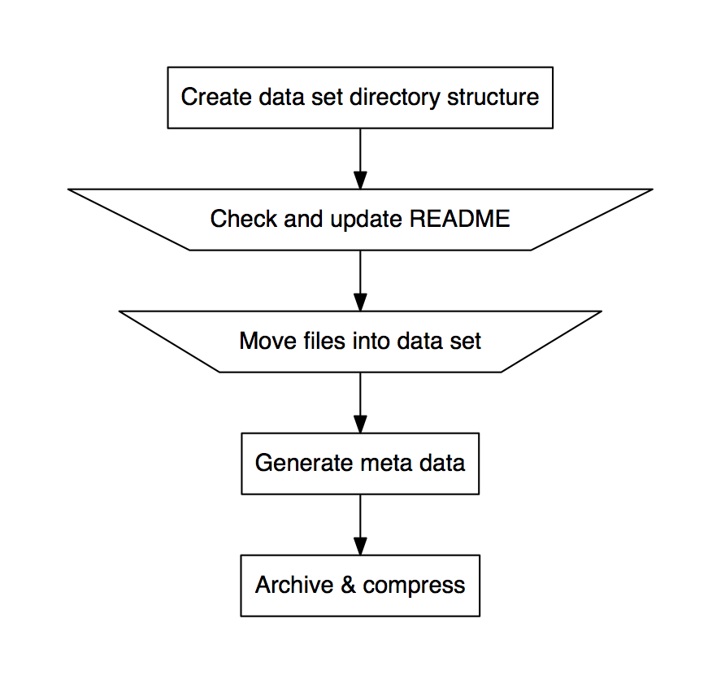

arctool
-------

Overview
~~~~~~~~

The ``arctool`` command line tool does several things.

1. Provides templates for meta data associated with a project in the plain
   text yaml file format
2. Provides a means to generate a manifest with meta data for all files in
   a data directory
3. Provides directory structure templates for archiving data
4. Provides wrappers to create tar archives
5. Provides wrappers to gzip tar archives
6. Provides wrappers to verify the integrity of files in gzipped tar archives

Below is a high level overview of the workflow.

Walkthrough
~~~~~~~~~~~

``arctool`` is a tool for archiving data.

Install or load the tool
^^^^^^^^^^^^^^^^^^^^^^^^

JIC users can load the ``arctool`` program on the cluster using the command below.

.. code-block:: none

    source /common/software/linuxbrew/Cellar/lmod/5.9.3/lmod/5.9.3/init/bash
    module use /common/modulefiles/Core
    module load arctool

To install the tool manually see :doc:`installation_notes`.

Creating a staging area
^^^^^^^^^^^^^^^^^^^^^^^

First you will need to create an archiving staging area.

::

    $ mkdir archive_staging_area
    $ cd archive_staging_area

Making a new archive
^^^^^^^^^^^^^^^^^^^^

Warning: this section of the documentation assumes functionality that will be
added in a future release. Specifically, the creation of project part of the 
directory structure is not yet implemented.

To start building an archive use ``arctool new``, this will create a directory structure
in the working directory (``archive_staging_area``) and prompt you to specify some meta
data associated with the project.

::

    $ arctool new

    # Add ouput here

This results in the directory structure below.

::

    $ tree some_project

    # Add output here

Editing dataset meta data
^^^^^^^^^^^^^^^^^^^^^^^^^

Inspect and extend the ``some_project/data_set_1/README.yml`` as necessary.
This file is meant to provide overall meta data of the data set.

::

    $ cat some_project/data_set_1/README.yml

    # Add output here

Moving data into the dataset in the staging area
^^^^^^^^^^^^^^^^^^^^^^^^^^^^^^^^^^^^^^^^^^^^^^^^

Move your data to be archived into the ``some_project/data_set_1/archive``
directory.

::

    $ mv ~/my_old_project/data_set_1/* some_project/data_set_1/archive/

Generating file meta data
^^^^^^^^^^^^^^^^^^^^^^^^^

Generate meta data for the files that you just moved into the
``some_project/data_set_1/archive`` directory.

::

    $ arctool manifest create some_project/data_set_1

Creating the archive file
^^^^^^^^^^^^^^^^^^^^^^^^^

Create a tar ball of the data set.

::

    $ arctool archive create some_project/data_set_1

    # Add output here

Compressing the archive
^^^^^^^^^^^^^^^^^^^^^^^

Compress the archive using gzip compression.

::

    $ arctool archive compress some_project/data_set_1

    # Add output here

Moving the archive into long term storage
^^^^^^^^^^^^^^^^^^^^^^^^^^^^^^^^^^^^^^^^^

Finally move the gzipped tarball archive into your long term storage.

Deleting original data
^^^^^^^^^^^^^^^^^^^^^^

Now you can delete the original data.

Tab completion
~~~~~~~~~~~~~~

arctool supports tab completion for bash. To enable it, enter the following in your shell:

::

    $ eval "$(_ARCTOOL_COMPLETE=source arctool)"

or add it to your .bashrc to enable permanently. You can also generate a sourceable bash shell with:

::

    $ _ARCTOOL_COMPLETE=source arctool > arctool-complete.sh

Logging with fluentd
~~~~~~~~~~~~~~~~~~~~

arctool sends logs to fluentd, a logging system. The fluentd server can be set
in two ways:

1. By setting the FLUENTD_HOST environment variable, e.g.:

   ::

       $ export FLUENTD_HOST=my_host.domain

2. By specifying the host on the command line, e.g.:

   ::

       $ arctool --fluentd-host my_host.domain <command>
